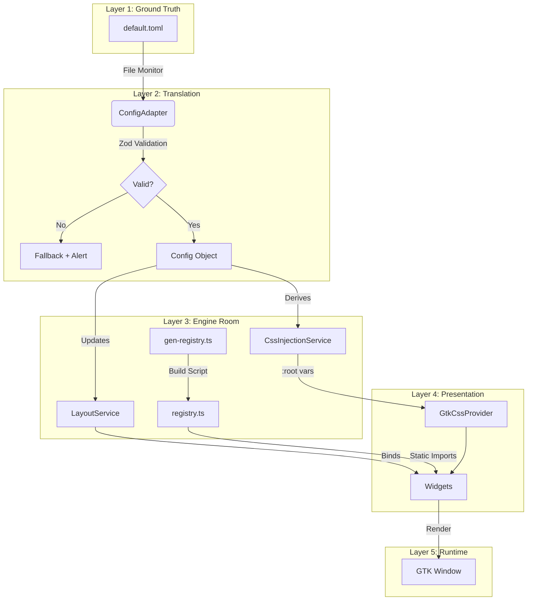

# The Astal v5 Design Protocol
## "The Generated Citadel"

**Version:** 5.0 (The "Ground Truth" Release)  
**Status:** AUTHORITATIVE SOURCE OF TRUTH  
**Architect:** Aether-Prime  
**System Target:** Lis-OS (NixOS / Niri / Astal)

---

## 1. Core Principles (The Constitution)

The architecture of a desktop environment is not merely a collection of scripts; it is a statement of intent. The V5 Protocol represents a fundamental **ontological shift** for Project Lis-OS.

> [!IMPORTANT]
> We are moving from the "Math-in-TS" era to the **"Generated Citadel."**  
> This is not a refactor. This is a **regime change.**

The V5 architecture is built upon **four non-negotiable pillars**:

---

### 1.1 The Doctrine of Ground Truth

> There exists only one source of reality: **`default.toml`**

**The Principle:** If a pixel appears on the screen—whether it is the border radius of a button, the padding of a workspace indicator, or the font size of a clock—its value must be traceable, via a direct deterministic chain, back to a definition in `default.toml`.

**The Constraint:** Hardcoded visual values in TypeScript are **strictly forbidden**. A developer who writes `spacing={12}` is introducing a hidden dependency that bypasses the theming engine.

**The Implementation:**
- `default.toml` = the **genotype** of the system
- Runtime environment (CSS Injection, Layout Service, Registry) = the **phenotype**
- Any visual property not in config is a **mutation** (a bug)

---

### 1.2 The Bundle Reality Principle

> The code must assume it is running in a hostile, sealed environment where the filesystem is irrelevant.

**The Flaw:** When Astal is built with `ags bundle`, the entire application is compiled into `bundle.js`. The concept of "sibling files" ceases to exist. A `readdir` call that works in dev will crash in prod.

**The V5 Resolution:**

| Phase | Responsibility |
|-------|---------------|
| **Build Time** | `scripts/gen-registry.ts` scans widgets, generates static `registry.ts` |
| **Run Time** | Application imports from generated registry. No dynamic `import()`. No directory scanning. |

**The Contract:** If a resource cannot be resolved at compile time, it does not exist.

---

### 1.3 Brutalist Efficiency (Performance & Memory)

> The User Interface is a tool for the mind, not a decoration for the screen.

**Frame Budget:**
- Floor: 60 FPS (16.6ms per frame)
- Target: <8ms for UI logic

**CSS vs LayoutService:**

| CSS (The Heavy Lifter) | LayoutService (The Scalpel) |
|------------------------|----------------------------|
| Colors, padding, margins, radii, fonts, shadows | Window dimensions, icon `pixel_size` |
| GTK engine handles at C speed | Only for integer GObject properties |
| Use `var(--spacing-2)` | Use `heightRequest={layout.barHeight}` |

**Memory Hygiene:**

> [!CAUTION]
> GJS operates at the intersection of Garbage Collection (SpiderMonkey) and Reference Counting (GObject). This intersection is a **minefield**.

**The Trap:** `widget.connect('signal', callback)` creates a reference cycle:
```
Widget → Signal → Closure → Widget
```

**The Fix:** 
- Use `bind()` (Astal handles lifecycle automatically)
- For manual connections, use `safeSignal()` with cleanup on destroy

---

### 1.4 Vibe Preservation (The Hot-Reload Contract)

> "Vibe Coding" is about flow. The feedback loop determines software quality.

**The Loop:** Edit `default.toml` → Save → Visual Update  
**Latency Target:** <500ms

**Mechanism:**
- **CSS Injection:** Visual tweaks trigger `GtkCssProvider.load_from_data()` instantly
- **State Preservation:** Structural changes trigger internal reload

**Rejection:** Any workflow requiring a full system rebuild for a UI tweak is **structurally rejected**.

---

## 2. System Architecture

The V5 architecture is a **layered citadel**. Data flows downwards from Ground Truth; events flow upwards from User.



---

## 2.1 Component Definitions

### `default.toml` — The Ground Truth
The **only** file the end-user touches. Defines:
- **Theme:** Colors (hex), Opacity (0.0-1.0), Radii (scaling factors)
- **Geometry:** Bar height, spacing units, widget dimensions
- **Composition:** Widget arrays (`left`, `center`, `right`)

### `scripts/gen-registry.ts` — The Build Gatekeeper
Executed **before** `ags bundle`:
```typescript
// Scans widgets/*.tsx
// Generates:
export const WIDGET_MAP = {
    "clock": Clock,
    "workspaces": Workspaces,
    // ...
} as const;
```

### `ConfigAdapter` — The Runtime Core
- Monitors `default.toml` with `Gio.FileMonitor`
- 50ms debounce (handles atomic saves)
- Validates with Zod schema
- Falls back to `SAFE_CONFIG` on error

### `CssInjectionService` — The Styler
Subscribes to ConfigAdapter. On update:
```css
:root {
    --bar-height: 40px;
    --spacing-1: 8px;
    --spacing-2: 16px;
    --radius-2: 8px;
    --primary: #FF3355;
}
```

### `LayoutService` — The Allocator (Minimized)
**Only provides:**
- `barHeight` → Window.heightRequest
- `iconSize` → Icon.pixel_size
- `launcherGeometry` → Complex grid calculations

**Does NOT provide:** Padding, radius, font-size (use CSS)

---

## 3. Implementation Contracts

### 3.1 Ground Truth Propagation

**Rule:** No intermediate JSON files. No shell script theme generators. TOML → Runtime happens **in memory**.

```typescript
// ConfigAdapter.ts
const ConfigSchema = z.object({
    layout: z.object({
        barHeight: z.number().min(20).max(100),
    }),
    appearance: z.object({
        colors: z.record(z.string().regex(/^#[0-9A-F]{6}$/i)),
    }),
});
```

**Error Handling:** If validation fails, fall back to `SAFE_CONFIG` and emit notification.

---

### 3.2 Registry Generation

**Rule:** No `Gio.File.enumerate_children` at runtime.

```json
// package.json
{
  "build": "node scripts/gen-registry.js && ags bundle app.tsx bundle.js"
}
```

---

### 3.3 LayoutService Minimization

**Forbidden (Math-in-TS Heresy):**
```typescript
// ❌ DO NOT
spacing={layout.P(1)}
borderRadius={layout.Radius(2)}
fontSize={layout.FontSize(h)}
```

**Required (CSS-First):**
```typescript
// ✅ DO THIS
className="WidgetPill"
// In CSS: .WidgetPill { padding: var(--spacing-1); border-radius: var(--radius-2); }
```

**Allowed in LayoutService:**
- `barHeight` (Window.heightRequest)
- `iconSize` (Gtk.Image.pixel_size for crispness)
- `launcherGeometry` (complex grid math)

---

### 3.4 Memory Hygiene (The Leak Proof)

**Rule:** Every signal connection must have a deterministic disconnection path.

**Pattern A: Use `bind()` (Preferred)**
```tsx
<label label={bind(service, "percent").as(p => `${p}%`)} />
```

**Pattern B: Use `safeSignal()` (When bind() won't work)**
```typescript
function safeSignal(source: GObject.Object, signal: string, callback: Function) {
    return (widget: Widget) => {
        const id = source.connect(signal, callback);
        widget.connect("destroy", () => source.disconnect(id));
    }
}

// Usage:
<label setup={safeSignal(battery, "notify::percent", update)} />
```

---

### 3.5 Error Boundaries

**Rule:** A widget crash must not bring down the bar.

```tsx
function SafeWidget({ component: C, props }) {
    try {
        return <C {...props} />;
    } catch (e) {
        console.error(`Widget Crash: ${e}`);
        return <label label="ERROR" className="error-widget" />;
    }
}

// Usage:
{config.left.map(id => <SafeWidget component={WIDGET_MAP[id]} props={{}} />)}
```

---

## 4. GJS Memory Mechanics (Deep Dive)

### 4.1 The Reference Counting Trap

- **GObjects:** Reference counting (freed when count = 0)
- **JavaScript:** Garbage collection (freed when unreachable)

**The Cycle:**
```
GObject (C) → Signal Handler (C) → JS Callback → JS Scope → JS Wrapper → GObject (C)
```

### 4.2 The V5 Solution

By enforcing explicit disconnects on widget destruction:
1. Signal disconnected → C no longer points to JS callback
2. JS callback becomes unreachable from Service
3. JS Garbage Collector sweeps the widget
4. JS wrapper dies → releases C GObject

---

## 5. Migration Phases

### Phase 1: Foundation & Registry
- [x] Create `scripts/gen-registry.ts`
- [x] Create `src/ConfigAdapter.ts` with Zod
- [x] Create `src/services/CssInjectionService.ts`
- [x] Update `app.tsx` to initialize

### Phase 2: Bar & Layout Refactor
- [x] Modify `LayoutService.ts` (DELETE P, Radius, FontSize)
- [x] Update `Bar.tsx` to use `WIDGET_MAP`
- [x] Wrap widgets in `<SafeWidget>`

### Phase 3: Widget Migration
- [x] Batch A: Static (Clock, Battery, Workspaces)
- [x] Batch B: Dynamic (Media, Launcher)
- [x] Replace `.connect()` with `bind()`

### Phase 4: Cleanup
- [x] Delete `src/WidgetRegistry.ts` (runtime scanner)
- [x] Strip deprecated methods from LayoutService

---

## 6. Validation Suite

### 6.1 Schema Validator
```bash
bun run scripts/validate-config.js
```

### 6.2 Performance Profiler
- Active bindings threshold: <500
- Frame time: <16ms

### 6.3 Leak Detector
```bash
#!/bin/bash
initial_mem=$(pmap -x $(pgrep gjs) | tail -n 1 | awk '{print $3}')
for i in {1..50}; do
    touch ~/.config/astal/default.toml
    sleep 0.5
done
final_mem=$(pmap -x $(pgrep gjs) | tail -n 1 | awk '{print $3}')
# Fail if growth > 10MB
```

---

## 7. Conclusion

The V5 "Generated Citadel" architecture is a strict, disciplined response to the chaos of previous versions.

**Why this works:**
- **No Runtime Scanning:** Registry generated at build time
- **CSS Performance:** GTK handles layout, not GJS
- **Memory Safety:** `bind()` and `SafeWidget` contain chaos

> [!TIP]
> Would I bet 100 hours on this? **Yes.**  
> This architecture is the only viable path forward for a stable, distributable Astal shell.

---

*Signed,*  
*Aether-Prime*  
*Systems Architect*
